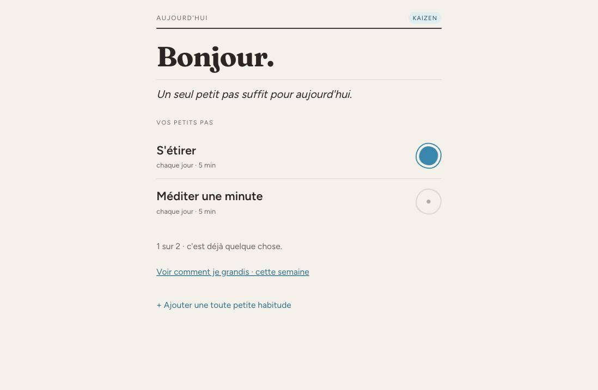
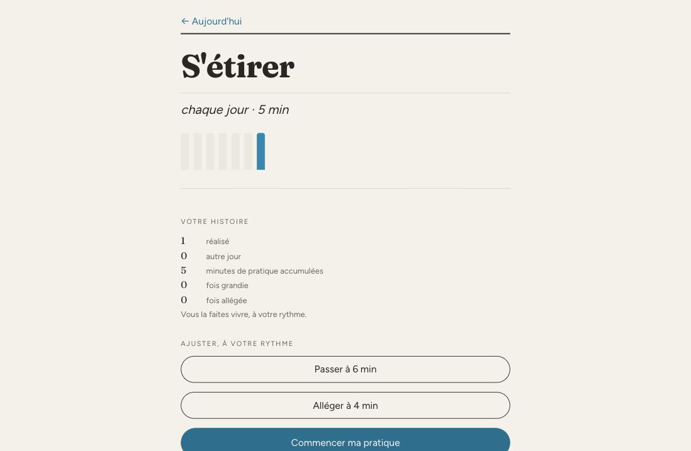
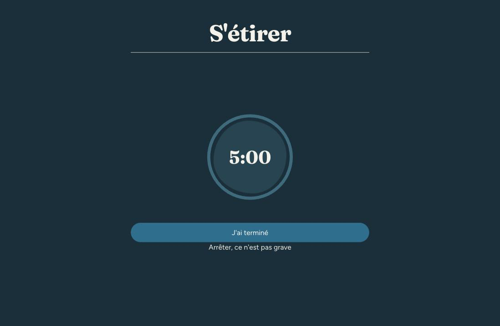
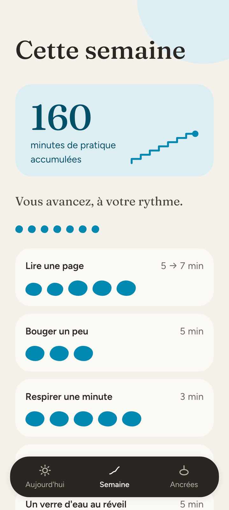
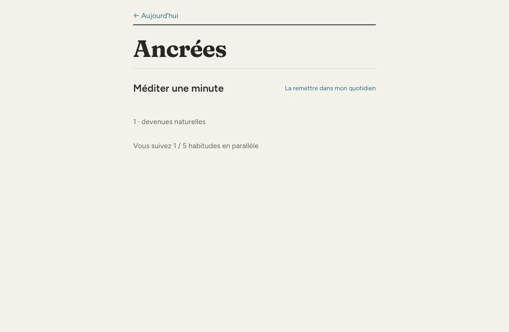
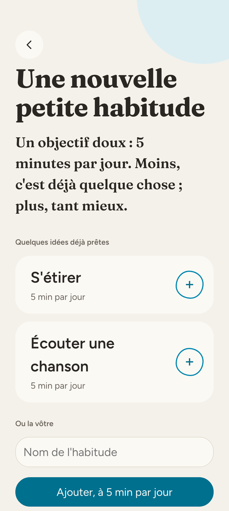

# 5 · Style graphique

Le design suit le système **Broadsheet** : du newsprint pour le web — Source Serif 4 noir
sur papier blanc, avec l'accent d'imprimerie (cyan) en petites touches
délibérées, comme du spot color. Hiérarchie par l'échelle du serif et le blanc, **pas de
boîtes ni de filets**.

## Couleurs

| Rôle | Hex | Usage |
| --- | --- | --- |
| Fond papier | `#f3f2f2` | fond de tous les écrans |
| Encre | `#201e1d` | texte |
| Cyan (accent) | `#0088b0` | l'interactif, et le fait d'avoir pratiqué |

Chaque rôle a une rampe tonale 100–900 (générée en OKLCH). Utiliser les pas clairs (100–300)
pour les fonds teintés et bordures, 500 comme base, 700–900 pour le texte sur fond teinté.
Ne jamais coder un hex en dur : passer par les variables `var(--color-*)`.

**Règle :** ne pas utiliser les deux accents dans un même petit composant.

**Règle — l'accent ne dit qu'une chose (tranché 2026-08-21 par l'owner, issue #30) :** en
dehors de l'interactif, le cyan signifie **« pratiqué »**, et rien d'autre. Un élément qui
n'encode pas une pratique ne le porte pas, même s'il est visuellement important. La
mini-courbe du récap semaine a coûté un bug dans les deux sens : le cyan y était allumé en
permanence, donc une habitude jamais faite se lisait comme validée (#30) ; puis, éteint en
permanence, il ne disait plus rien de la pratique (#32). Elle porte maintenant l'accent
**quand, et seulement quand, l'habitude a été pratiquée dans la fenêtre**. Avant de peindre
en accent, poser la question : *est-ce que cet élément affirme que l'utilisateur a
pratiqué ?* — non ⇒ tonalité neutre.

**Règle — la couleur ne porte jamais un signal toute seule (tranché 2026-08-22 par l'owner,
issue #32) :** un état qui ne se distingue que par la teinte n'existe pas pour un lecteur
daltonien, sur un écran en niveaux de gris, ou à l'impression. Le contraste qui compte est
celui de l'**état allumé contre l'état éteint**, pas celui de chacun contre le papier : la
mini-courbe passait ses deux états à 3:1 contre le papier tout en ne les séparant que de
**1,12:1** l'un de l'autre. Tout signal chromatique se double donc d'un indice de forme —
la présence ou l'absence d'un élément, jamais deux nuances du même. Les points de rythme et
l'escalier du détail ont encore ce défaut ; il attend une passe d'accessibilité dédiée.

## Typographie

- **Source Serif 4** partout — titres et corps. Pas de sans-serif pour l'UI : le serif *est*
  le chrome.
- L'**italique vraie** (pas oblique synthétique) porte l'émotion : phrases d'encouragement,
  synthèses, mot de la semaine.
- Densité 1.25× et rayon 2px sont déjà dans les variables `--space-*` / `--radius-*`.

## Icônes

**Phosphor**, poids **duotone** partout. Icônes utilisées :

| Écran / élément | Icône |
| --- | --- |
| Lire | `ph-book-open` |
| Bouger un peu | `ph-person-simple-walk` |
| Respirer | `ph-wind` |
| Rituel de la minute | `ph-timer` |
| Grandir (+1 min) | `ph-plant` |
| Alléger (−1 min) | `ph-feather` |
| Ancrer / acquises | `ph-seal-check`, `ph-anchor-simple` |
| Récap semaine | `ph-chart-line-up` |
| Ajouter | `ph-plus-circle` |
| Validation | `ph-check` |
| Pause | `ph-pause` |
| Idées d'ajout | `ph-drop`, `ph-broom`, `ph-pencil-simple`, `ph-flower-lotus`, `ph-seedling` |

## Motifs d'interaction

- Espacer les sections par du **blanc**, jamais des filets ou des cartes.
- Validation d'une habitude : la cible ronde se remplit d'accent cyan (`kzStamp`) avec un
  anneau qui se diffuse (`kzRing`) — récompense visuelle satisfaisante.
- Transition d'écran douce : léger fondu + montée (`kzUp`).
- Rituel : cercle central qui « respire » lentement (`kzBreathe`, 8 s).
- Chaque élément interactif : `:hover` teinté et état pressé (un pas de rampe au-delà de la
  base), focus clavier `outline: 2px solid var(--color-accent)`.

## Composants Broadsheet utilisés

- `.btn` / `.btn-primary` / `.btn-secondary` / `.btn-block` — actions.
- `.tag` / `.tag-accent` — petites étiquettes (ex. « +2 min », « ancrée »).
- `.field` + `.input` — champs de saisie (nom d'habitude, déclencheur, réflexion).
- Rampes `--color-*`, ombres `--shadow-sm/md/lg`.

## Animations (référence CSS)

```css
@keyframes kzStamp   { 0%{transform:scale(.35);opacity:0} 55%{transform:scale(1.12)} 100%{transform:scale(1);opacity:1} }
@keyframes kzRing    { 0%{transform:scale(.55);opacity:.55} 100%{transform:scale(2);opacity:0} }
@keyframes kzUp      { from{opacity:0;transform:translateY(8px)} to{opacity:1;transform:none} }
@keyframes kzBreathe { 0%,100%{transform:scale(.86);opacity:.7} 50%{transform:scale(1.08);opacity:1} }
```

En Rust/Dioxus, ces `@keyframes` se placent dans la feuille de style globale de l'app ;
les couleurs et l'anneau de progression du rituel se calculent côté logique (offset =
`circonférence × (1 − restant / total)`).

## Aperçu des écrans

Captures du prototype (référence visuelle 1:1 pour la réécriture).

### Aujourd'hui


### Détail d'une habitude


### Rituel d'une minute


### Cette semaine


### Ancrées (acquises)


### Ajouter

